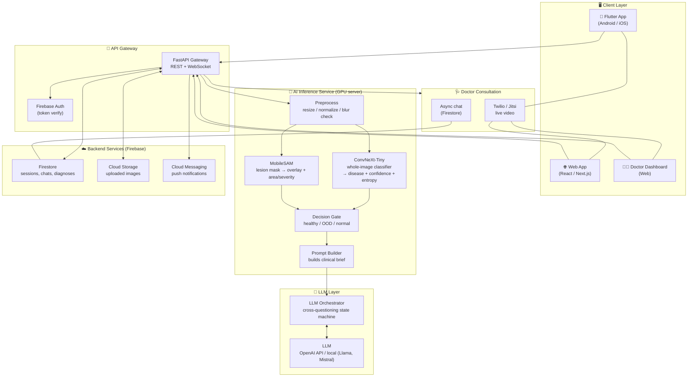
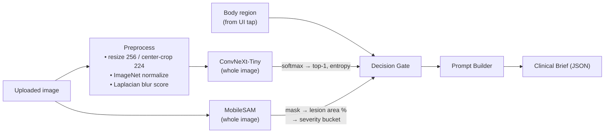
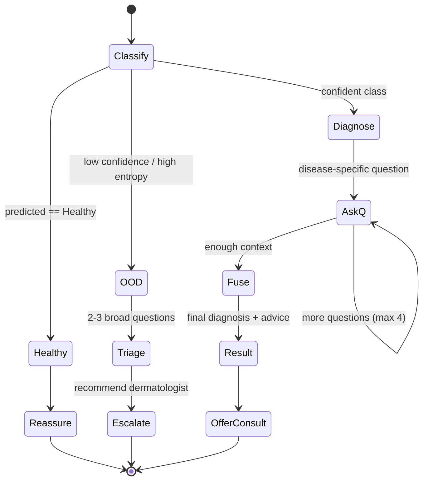
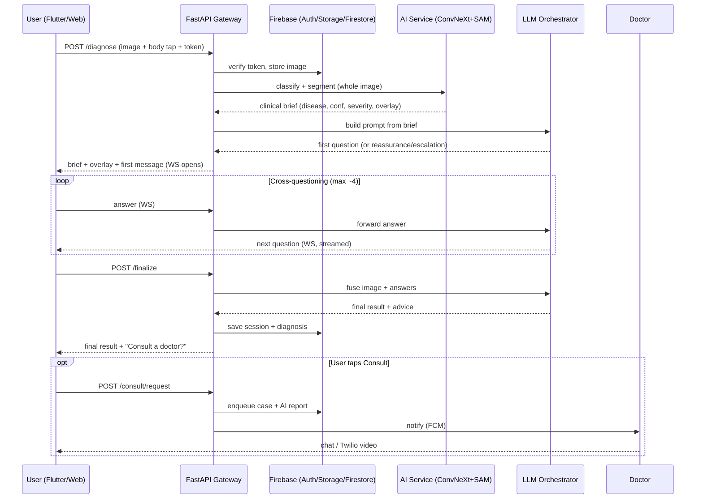
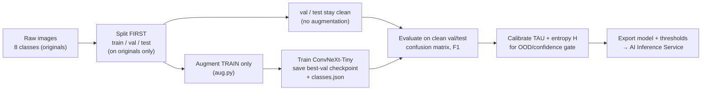
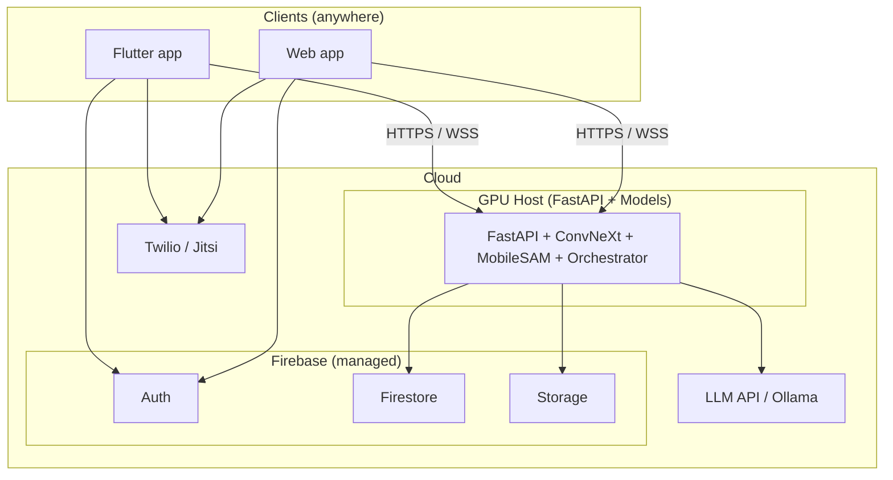

# DermAI — System Architecture

**AI-powered skin disease screening with image classification, lesion localization, LLM cross-questioning, and doctor consultation.**

Clients: **Flutter (Android/iOS)** + **Web app**. Backend: **FastAPI** + **Firebase**. AI: **ConvNeXt-Tiny** + **MobileSAM** + **LLM**.

---

## 1. Design principles (read this first)

These rules are baked into the architecture because of how the model was actually trained:

1. **ConvNeXt classifies the *whole* image, not a SAM crop.** The model was trained on full images (`RandomResizedCrop(224)`). Feeding it MobileSAM crops at inference would be a train/inference mismatch. → **SAM is used only for the visual overlay and a severity/area estimate, never as the classifier's input.**
2. **Body region comes from a UI tap, not a model.** The user taps the affected area on a body-map widget. 100% accurate, zero latency, zero extra ML risk.
3. **Confidence drives behaviour.** The classifier's softmax (top-1 confidence + entropy) decides one of three LLM modes: *healthy*, *out-of-distribution (OOD)*, *normal diagnosis*. Thresholds are calibrated on a **leakage-free** validation set (split-before-augment).
4. **The LLM never sees the raw image.** It receives a structured clinical brief (disease, confidence, region, severity) injected into its system prompt, so it asks doctor-style questions, not "what colour is it."
5. **Single 6 GB GPU.** Models are loaded once at startup and shared; inference is effectively sequential on the GPU (threads serialize on CUDA). Don't over-engineer parallelism.

---

## 2. High-level architecture



---

## 3. Layer-by-layer breakdown

### 3.1 Client layer

| Component | Tech | Responsibilities |
|---|---|---|
| **Mobile app** | Flutter (Dart) | Camera capture / gallery upload, **body-map tap selector**, symptom chat UI, results screen, video/chat consult, local session cache |
| **Web app** | React + Next.js (or Flutter Web) | Same features for desktop/browser; drag-drop upload |
| **Doctor dashboard** | React (web) | Queue of patient cases, AI report view, accept video/chat, write notes |

All clients are **thin** — no ML runs on-device. They authenticate with Firebase Auth and call the FastAPI gateway with the user's ID token. Chat uses a **WebSocket** so the LLM's questions stream in turn-by-turn.

> **Why no on-device TFLite?** Your model is PyTorch ConvNeXt-Tiny and the pipeline needs MobileSAM + an LLM — too heavy and too dependent on cloud services for on-device. Server-side inference keeps clients thin and the model swappable. (If on-device is later required, export ConvNeXt via ONNX → TFLite; SAM/LLM stay in the cloud.)

### 3.2 API gateway — FastAPI

Single entry point. Chosen because the ML stack is Python, so the gateway and inference can share the process/host with no serialization overhead.

| Endpoint | Method | Purpose |
|---|---|---|
| `/auth/verify` | internal | Validate Firebase ID token on every request |
| `/diagnose` | POST | Upload image + body region → returns diagnosis brief + first LLM message |
| `/chat/{session_id}` | WS | Streaming cross-questioning conversation |
| `/finalize/{session_id}` | POST | Fuse image + answers → final result + advice |
| `/consult/request` | POST | Create a doctor consultation request |
| `/history` | GET | Past sessions for the logged-in user |

### 3.3 AI inference service (the core)

Runs on the GPU host. Models loaded **once** at startup (FastAPI lifespan event), kept warm in VRAM.



**Decision Gate logic:**

```
top_prob, entropy = softmax(logits)
if predicted == "Healthy":            mode = HEALTHY
elif top_prob < TAU or entropy > H:   mode = OOD       # TAU, H tuned on clean val
else:                                 mode = NORMAL
```

**Clinical brief produced:**

```json
{
  "mode": "NORMAL",
  "disease": "Eczema",
  "confidence": 0.87,
  "second_guess": {"disease": "Psoriasis", "confidence": 0.06},
  "body_region": "forearm",
  "severity": "moderate",          // from SAM lesion-area %
  "lesion_area_pct": 12.4,
  "image_quality": "clear"
}
```

### 3.4 LLM layer

The **orchestrator** is a small state machine that:
1. Picks the system-prompt template by `mode` (healthy / OOD / normal).
2. Injects the clinical brief.
3. Drives a bounded conversation (e.g. max 4 questions), one question per turn over the WebSocket.
4. Calls **fusion**: combines the image prediction with the collected answers into a final, plain-language result + "consult a doctor" recommendation.

The LLM is **pluggable** — OpenAI API for the demo, or a local model (Llama 3 / Mistral via Ollama) if you need offline/cost control. The orchestrator is provider-agnostic.



### 3.5 Backend services — Firebase

| Service | Use |
|---|---|
| **Firebase Auth** | Email/Google sign-in; ID tokens verified by FastAPI |
| **Firestore** | Sessions, chat transcripts, diagnoses, doctor queue (real-time sync) |
| **Cloud Storage** | Uploaded images (private, per-user paths) |
| **Cloud Messaging (FCM)** | Push when a doctor replies / consult starts |

### 3.6 Doctor consultation

- **Async:** patient case + AI report lands in the doctor dashboard queue (Firestore). Doctor replies in chat.
- **Live:** Twilio Video (or self-hosted Jitsi to save cost) room created on demand; link pushed to both parties.
- **Handoff payload:** the AI clinical brief + full Q&A transcript so the doctor starts informed.

---

## 4. Request lifecycle (end-to-end)



---

## 5. Offline training & data pipeline (critical fix)

This is separate from the live system and **must be corrected** — your current data has train/val leakage (augmented variants of the same photo split across both).



**Order that must change:** split → augment-train-only → train → evaluate on clean data → calibrate thresholds → deploy. The current order (augment → split) is what makes the confusion matrix look near-perfect and what makes the LLM's confidence thresholds meaningless.

---

## 6. Technology stack summary

| Layer | Technology |
|---|---|
| Mobile | Flutter (Dart) |
| Web | React + Next.js (or Flutter Web) |
| Doctor dashboard | React |
| API gateway | FastAPI (Python), Uvicorn |
| Image classifier | ConvNeXt-Tiny (PyTorch) — **whole image** |
| Lesion localization | MobileSAM — **overlay + severity only** |
| LLM | OpenAI API (demo) / Llama 3 / Mistral via Ollama (local) |
| Auth | Firebase Auth |
| Database | Firestore |
| Image storage | Firebase Cloud Storage |
| Video consult | Twilio Video / Jitsi |
| Push | Firebase Cloud Messaging |
| Annotation/aug (offline) | Roboflow / OpenCV (`aug.py`) |
| GPU host | RTX 4050 6 GB (dev) → cloud GPU for deployment |

---

## 7. Deployment topology



For the FYP demo, the GPU host can be your laptop (RTX 4050) exposed via a tunnel (e.g. ngrok) or a low-cost cloud GPU. Firebase is fully managed.

---

## 8. The 8 classes

`Acne`, `Atopic Dermatitis`, `Eczema`, `Healthy`, `Hyper Pigmentation`, `Melanoma`, `Psoriasis`, `Seborrheic Keratoses`.

> Note: there is **no "fungal infection"** class despite the proposal text — align the report to these 8. Also fix the dataset folder typo `Hyper Pigmintation` → `Hyper Pigmentation`.
